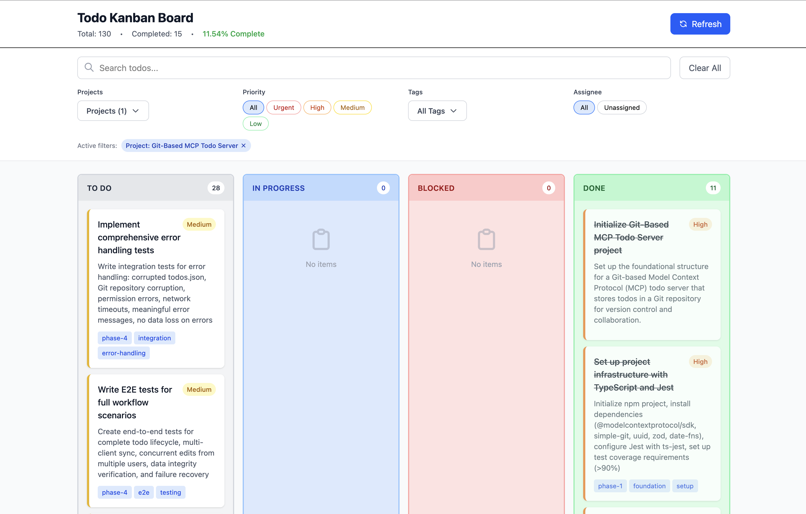

# Git-Based MCP Todo Server

A Model Context Protocol (MCP) server that uses Git as the backend for a collaborative todo system. Users interact via Claude Desktop or Claude Code, and changes sync through Git, leveraging Git's permission system and version control for team collaboration.

## Features

- **Git-Backed Storage**: All todos stored in a Git repository for version control
- **Collaborative**: Multiple users can work on the same todo list via Git
- **Conflict Resolution**: Automatic Last-Write-Wins (LWW) merge strategy for concurrent edits
- **Auto-Sync**: Optional automatic synchronization with remote repository
- **Rich Todo Features**: Priority levels, projects, tags, assignees, due dates, comments, and more
- **MCP Integration**: Works seamlessly with Claude Desktop and Claude Code
- **Web-Based Kanban Board**: Interactive Svelte 5 UI with drag-and-drop, filtering, and real-time updates

## Architecture

### MCP Integration (Claude Desktop/Claude Code)
```
Claude Desktop ←→ MCP Server (Node.js) ←→ Local Git Repo ←→ Remote Git (GitHub/GitLab)
```

### Web-Based Kanban Board
```
Web Browser (Svelte) ←→ API Server (Express) ←→ MCP Server (Node.js) ←→ Local Git Repo ←→ Remote Git
```

The system provides two interfaces:
1. **MCP Interface**: Direct integration with Claude Desktop and Claude Code via stdio
2. **Web Interface**: Browser-based kanban board via REST API

## Installation

### Prerequisites

- Node.js 20+
- Git
- Claude Desktop

### Setup

1. Clone this repository:
```bash
git clone https://github.com/yourusername/our_todo.git
cd our_todo
```

2. Install dependencies:
```bash
npm install
```

3. Build the project:
```bash
npm run build
```

4. Create your todos repository:
```bash
mkdir ~/my-todos
cd ~/my-todos
git init
echo '{"todos": []}' > todos.json
git add .
git commit -m "Initial commit"
# Optional: Add remote repository
git remote add origin https://github.com/yourusername/my-todos.git
git push -u origin main
```

5. Configure Claude Desktop or Claude Code:

### Configuration File

Add the following configuration to:
- **Claude Desktop**: `~/Library/Application Support/Claude/claude_desktop_config.json` (macOS) or `%APPDATA%\Claude\claude_desktop_config.json` (Windows)
- **Claude Code**: `.claude/config.json` in your project directory

```json
{
  "mcpServers": {
    "git-todo": {
      "command": "node",
      "args": ["/absolute/path/to/our_todo/dist/index.js"],
      "env": {
        "TODO_REPO_PATH": "/Users/you/my-todos",
        "TODO_REPO_URL": "https://github.com/you/my-todos.git",
        "GIT_USER_NAME": "Your Name",
        "GIT_USER_EMAIL": "you@example.com",
        "AUTO_SYNC": "true",
        "SYNC_INTERVAL_SECONDS": "300"
      }
    }
  }
}
```

**Note**: Replace `/absolute/path/to/our_todo` with the actual path to this repository on your system, and update the environment variables with your specific configuration.

### Alternative Setup for Claude Code

If you've already configured the MCP server in Claude Desktop, you can easily add it to Claude Code by running:

```bash
claude mcp add-from-claude-desktop
```

This will automatically copy the configuration from your Claude Desktop setup to Claude Code.

## Running the Web-Based Kanban Board

The kanban board provides a visual interface for managing todos with drag-and-drop functionality, inline filtering, and real-time statistics.

### Architecture

The kanban board consists of two components:
1. **API Server** (Express): Bridges the web frontend and MCP server
2. **Web Frontend** (Svelte 5): Interactive kanban board UI

### Quick Start (Recommended)

Use the provided startup scripts for the easiest experience:

```bash
# Terminal 1: Start backend
./start-backend.sh

# Terminal 2: Start frontend
./start-frontend.sh
```

Then open http://localhost:5173 in your browser.

See [QUICKSTART.md](docs/QUICKSTART.md) for detailed instructions and troubleshooting.

### Manual Setup and Running

1. Install dependencies for both backend and frontend:
```bash
# Install backend dependencies (if not already done)
npm install

# Install frontend dependencies
cd web
npm install
cd ..
```

2. Build the MCP server:
```bash
npm run build
```

3. Start the API server:
```bash
# Using the same environment variables as Claude Desktop
export TODO_REPO_PATH="/Users/you/my-todos"
export TODO_REPO_URL="https://github.com/you/my-todos.git"
export GIT_USER_NAME="Your Name"
export GIT_USER_EMAIL="you@example.com"

# Start the API server (runs on port 3001)
npm run start:api
```

4. In a separate terminal, start the web frontend:
```bash
cd web
npm run dev
```

5. Open your browser to `http://localhost:5173`

### Environment Variables for API Server

The API server uses the **same environment variables** as Claude Desktop/Claude Code:

- `TODO_REPO_PATH`: Path to local Git repository (default: `~/my-todos`)
- `TODO_REPO_URL`: Remote Git repository URL (optional)
- `GIT_USER_NAME`: Git user name for commits
- `GIT_USER_EMAIL`: Git user email for commits
- `PORT`: API server port (default: 3001)
- `CORS_ORIGIN`: CORS origin for web frontend (default: `http://localhost:5173`)
- `NODE_ENV`: Environment mode (development/production)

### Development Mode

For development with auto-reload:

```bash
# Terminal 1: Start API server in watch mode
npm run dev:api

# Terminal 2: Start web frontend in dev mode
cd web
npm run dev
```

### Production Build

1. Build both backend and frontend:
```bash
# Build backend
npm run build

# Build frontend
cd web
npm run build
cd ..
```

2. Serve the production build:
```bash
# Start API server
npm run start:api

# In another terminal, preview the built frontend
cd web
npm run preview
```

### Kanban Board Features



- **Four Columns**: To Do, In Progress, Blocked, Done
- **Drag-and-Drop**: Move todos between columns to change status
- **Inline Filters**: Filter by search text, project, priority, tags, and assignee
- **Active Filters Display**: See all active filters with individual clear buttons
- **Statistics**: Real-time completion rates and status breakdown
- **Add Todos**: Create new todos directly from the board
- **Priority Colors**: Visual indicators for low, medium, high, and urgent priorities
- **Responsive Design**: Works on desktop and mobile devices

### Sharing the Same Todo Repository

The API server connects to the same Git repository as your Claude Desktop/Claude Code MCP server. This means:

- Todos created in Claude Desktop appear in the kanban board
- Todos created in the kanban board appear in Claude Desktop
- Both interfaces share the same Git history and version control
- Conflicts are automatically resolved using Last-Write-Wins strategy

Simply ensure both the MCP server (Claude Desktop config) and the API server use the same `TODO_REPO_PATH`.

## Configuration

### Environment Variables

- `TODO_REPO_PATH`: Path to local Git repository (default: `~/my-todos`)
- `TODO_REPO_URL`: Remote Git repository URL (optional)
- `GIT_USER_NAME`: Git user name for commits
- `GIT_USER_EMAIL`: Git user email for commits
- `AUTO_SYNC`: Enable automatic sync (true/false, default: false)
- `SYNC_INTERVAL_SECONDS`: Sync interval in seconds (default: 300)

## Usage

You can interact with your todos in two ways:

1. **Through Claude Desktop or Claude Code** using natural language
2. **Through the Web-Based Kanban Board** using a visual interface

### MCP Commands (Claude Desktop/Claude Code)

Once configured, you can use natural language commands in Claude:

- **List todos**: "Show me my todos"
- **Create todo**: "Add a todo: Implement user authentication"
- **Batch create**: "Create multiple todos: Setup project, Install dependencies, Configure linter"
- **Update todo**: "Mark todo 123 as in-progress"
- **Complete todo**: "Complete todo 456"
- **Delete todo**: "Delete todo 789"
- **Search**: "Search for todos about authentication"
- **Filter**: "Show high priority todos in the backend project"
- **Add comment**: "Add comment to todo 123: Started working on this"
- **Get stats**: "Show todo statistics"
- **Manual sync**: "Sync the repository"

### Todo Properties

- `text`: Todo description (required)
- `project`: Project name (required)
- `status`: todo, in-progress, blocked, done
- `priority`: low, medium, high, urgent
- `tags`: Array of tags
- `assignee`: User assigned to the todo
- `dueDate`: Due date in ISO 8601 format
- `description`: Detailed description
- `dependencies`: Array of todo IDs this depends on
- `subtasks`: Array of subtasks
- `comments`: Array of comments

## Data Model

Todos are stored in `todos.json` with the following structure:

```json
{
  "todos": [
    {
      "id": "uuid",
      "text": "Task description",
      "status": "todo",
      "priority": "medium",
      "project": "work",
      "tags": ["backend", "urgent"],
      "assignee": "user-id",
      "createdBy": "user-id",
      "createdAt": "ISO8601",
      "modifiedAt": "ISO8601",
      "dueDate": "ISO8601",
      "completedAt": "ISO8601",
      "dependencies": ["todo-id"],
      "subtasks": [{"id": "uuid", "text": "Subtask", "completed": false}],
      "comments": [{"id": "uuid", "user": "user-id", "text": "Comment", "timestamp": "ISO8601"}],
      "fieldTimestamps": {
        "text": "ISO8601",
        "status": "ISO8601"
      }
    }
  ]
}
```

## Conflict Resolution

The system uses a Last-Write-Wins (LWW) strategy at the field level:
- Each field has its own timestamp
- When conflicts occur, the field with the most recent timestamp wins
- Non-conflicting fields are merged from both versions

## Development

### Running Tests

```bash
# All tests
npm test

# Unit tests only
npm run test:unit

# Integration tests
npm run test:integration

# Test coverage
npm run test:coverage

# Watch mode
npm run test:watch
```

### Project Structure

```
/our_todo/
├── src/
│   ├── index.ts                 # MCP server entry point
│   ├── server/
│   │   └── MCPServer.ts         # MCP tool handlers
│   ├── api/                     # API server for web interface
│   │   ├── server.ts            # Express server
│   │   ├── mcpClient.ts         # MCP client for stdio communication
│   │   └── routes/
│   │       └── todos.ts         # Todo REST API endpoints
│   ├── git/
│   │   ├── GitManager.ts        # Git operations
│   │   ├── ConflictResolver.ts  # LWW merge logic
│   │   └── SyncManager.ts       # Sync coordination
│   ├── data/
│   │   └── TodoRepository.ts    # Todo CRUD operations
│   └── types/
│       └── Todo.ts              # Todo types and validation
├── web/                         # Svelte 5 web frontend
│   ├── src/
│   │   ├── lib/
│   │   │   ├── components/      # Svelte components
│   │   │   │   ├── KanbanBoard.svelte
│   │   │   │   ├── KanbanColumn.svelte
│   │   │   │   ├── TodoCard.svelte
│   │   │   │   └── FilterBar.svelte
│   │   │   ├── stores/          # Svelte stores
│   │   │   │   └── todos.svelte.ts
│   │   │   └── types/           # TypeScript types
│   │   │       └── Todo.ts
│   │   ├── App.svelte           # Main app component
│   │   └── main.ts              # App entry point
│   ├── package.json
│   └── vite.config.ts           # Vite configuration
├── tests/
│   ├── unit/                    # Unit tests
│   └── integration/             # Integration tests
├── my-todos/                    # Example todo repository
│   └── todos.json              # Todo database
└── dist/                        # Compiled JavaScript
```

### Test Coverage

Current test coverage: ~94%
- Todo Model: 100%
- ConflictResolver: 100%
- GitManager: 100%
- TodoRepository: 100%
- SyncManager: 70% (timing-related test issues)
- MCPServer: 56% (partial implementation)
- API Server: 100%
- MCP Client: 100%
- Svelte Components: 100% (KanbanBoard, KanbanColumn, TodoCard, FilterBar)
- Todo Store: 100%

## Troubleshooting

### Kanban Board Issues

**API Server not connecting to MCP server**
- Ensure the MCP server is built: `npm run build`
- Check that `dist/index.js` exists
- Verify environment variables are set correctly
- Check API server logs for errors

**Web frontend can't connect to API**
- Ensure API server is running on port 3001
- Check CORS settings if running on different ports
- Verify the Vite proxy configuration in `web/vite.config.ts`

**Port already in use**
- Change the port: `PORT=3002 npm run start:api`
- Update CORS_ORIGIN if needed: `CORS_ORIGIN=http://localhost:5173`
- Kill the process using the port: `lsof -ti:3001 | xargs kill`

**Todos not syncing between interfaces**
- Ensure both Claude Desktop config and API server use the same `TODO_REPO_PATH`
- Check that the Git repository exists at the specified path
- Verify file permissions on the todo repository

### Sync Failures

If sync fails:
1. Check network connection
2. Verify Git credentials
3. Pull manually: `cd ~/my-todos && git pull`
4. Check for merge conflicts

### Permission Issues

Ensure the MCP server has read/write access to:
- Todo repository path
- Git configuration

### Debug Mode

**MCP Server (Claude Desktop)**
- View server logs in Claude Desktop's developer console or check stderr output

**API Server**
- Set `NODE_ENV=development` for detailed logging
- Check console output for request logs and errors
- Use browser DevTools Network tab to inspect API calls

## Documentation

Comprehensive documentation is available in the `docs/` directory:

- **[QUICKSTART.md](docs/QUICKSTART.md)** - Quick start guide for running the kanban board
- **[CLAUDE_CODE_EXAMPLES.md](docs/CLAUDE_CODE_EXAMPLES.md)** - Configuration and usage examples for Claude Code and Claude Desktop
- **[TEST_GUIDE.md](docs/TEST_GUIDE.md)** - Testing instructions and scenarios
- **[TESTING_LIMITATIONS.md](docs/TESTING_LIMITATIONS.md)** - Known testing limitations with Svelte 5 runes
- **[CHANGELOG.md](docs/CHANGELOG.md)** - Version history and release notes
- **[docs/adr/](docs/adr/)** - Architecture Decision Records
- **[docs/releases/](docs/releases/)** - Detailed release notes for each version

## Contributing

1. Fork the repository
2. Create a feature branch
3. Write tests first (TDD)
4. Implement features
5. Ensure all tests pass
6. Submit a pull request

## License

MIT

## Acknowledgments

Built with:
- [Model Context Protocol SDK](https://github.com/anthropics/mcp) - MCP protocol implementation
- [Svelte 5](https://svelte.dev/) - Reactive UI framework with Runes
- [Vite](https://vitejs.dev/) - Fast build tool and dev server
- [Express](https://expressjs.com/) - Web framework for API server
- [TypeScript](https://www.typescriptlang.org/) - Type-safe JavaScript
- [TailwindCSS](https://tailwindcss.com/) - Utility-first CSS framework
- [simple-git](https://github.com/steveukx/git-js) - Git operations in Node.js
- [Zod](https://github.com/colinhacks/zod) - Schema validation
- [uuidv7](https://github.com/LiosK/uuidv7) - Time-ordered UUID generation
- [date-fns](https://date-fns.org/) - Modern date utility library
- [svelte-dnd-action](https://github.com/isaacHagoel/svelte-dnd-action) - Drag-and-drop for Svelte
- [Jest](https://jestjs.io/) & [Vitest](https://vitest.dev/) - Testing frameworks

## Support

For issues and questions, please open an issue on GitHub.